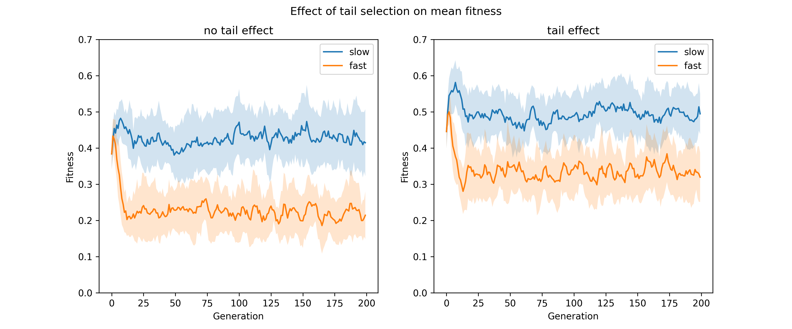
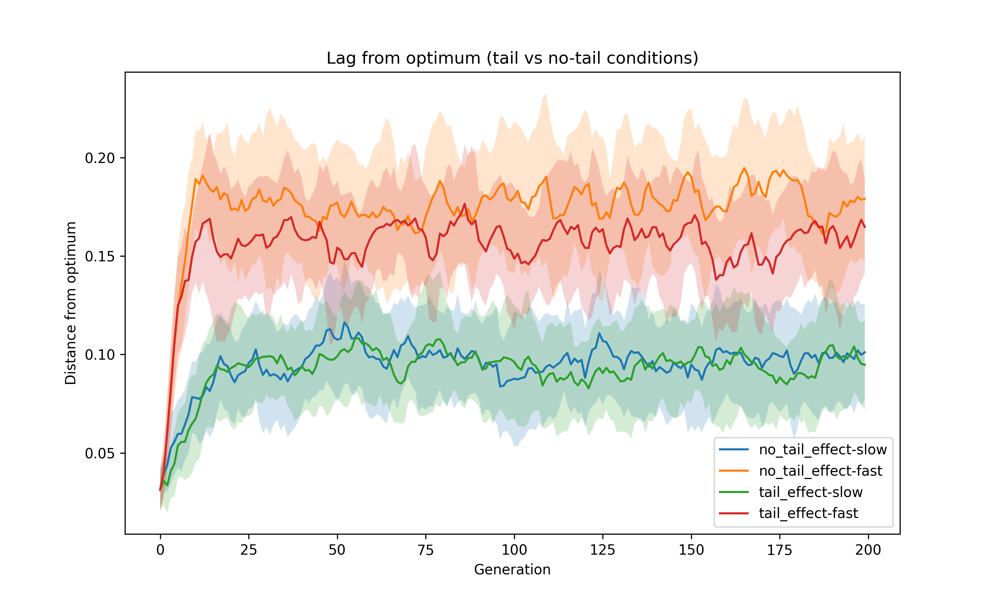
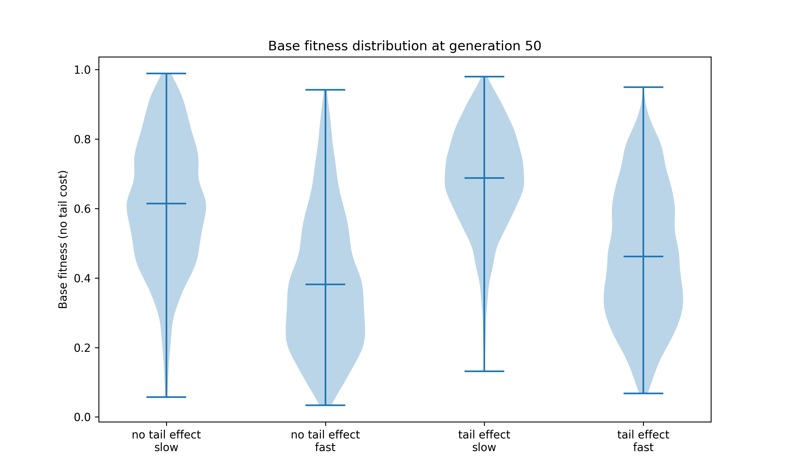
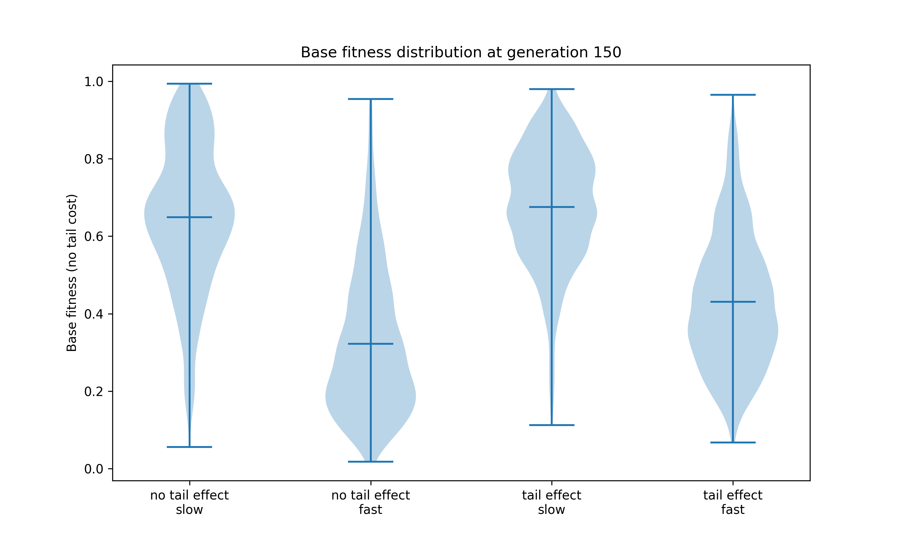
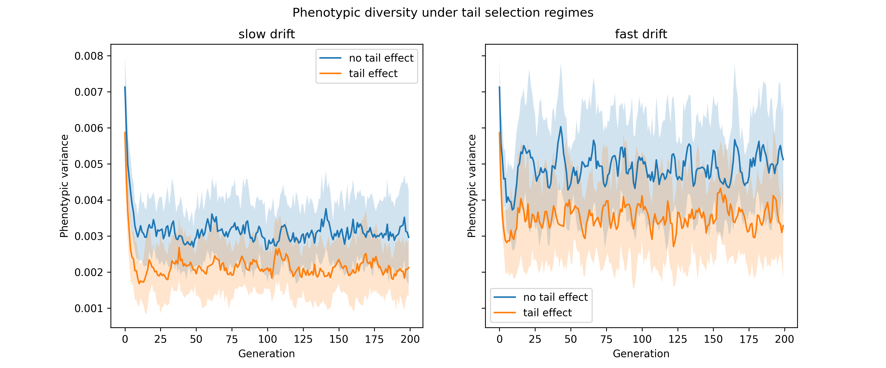
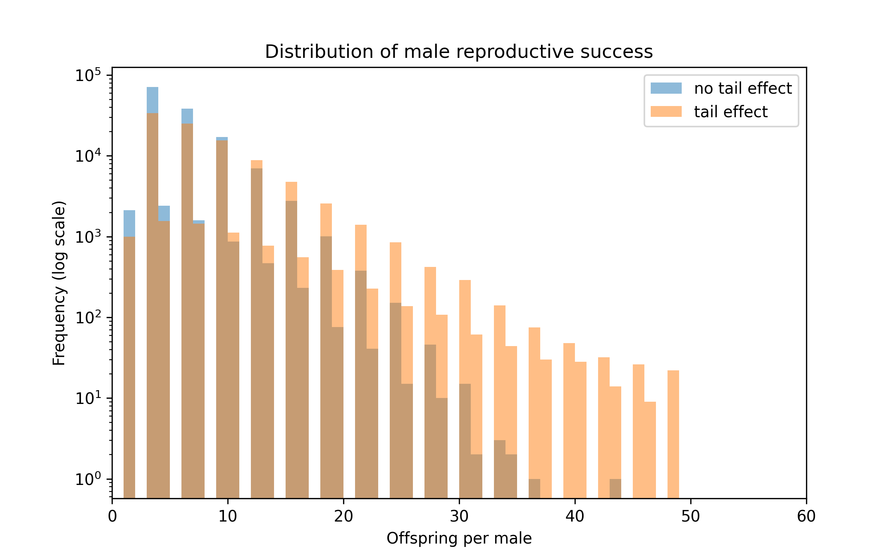
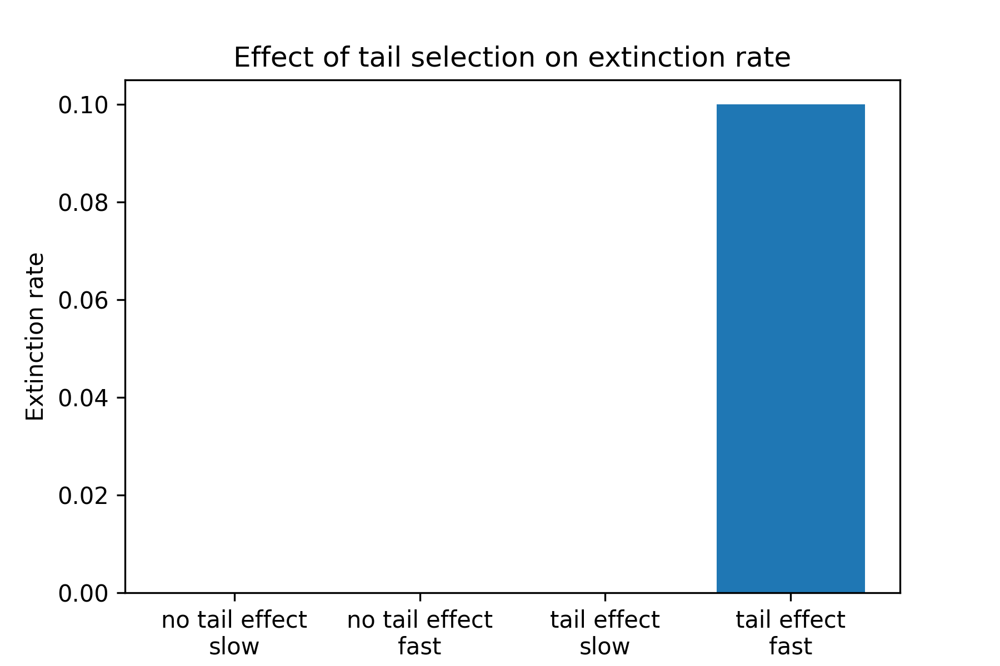
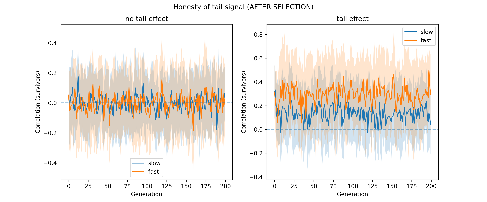
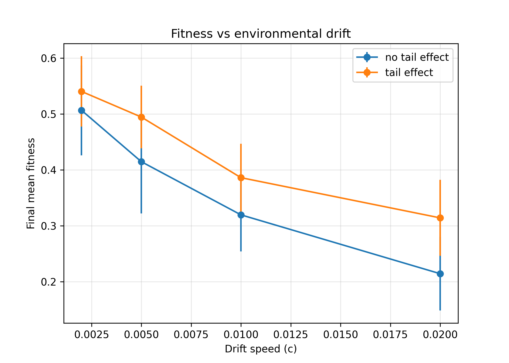
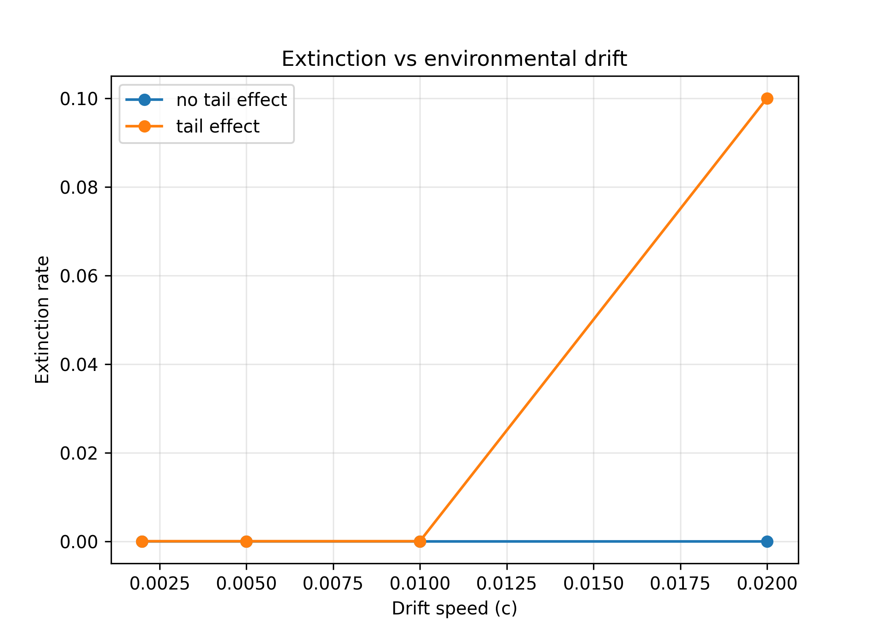

### Introduction

Many species exhibit traits that reduce survival but increase reproductive success, such as elaborate tails in male birds. The handicap principle suggests that only high-quality individuals can afford costly ornaments, making them honest signals of quality.

This study tests whether a costly sexual trait (tail length) can be maintained and whether it correlates with individual quality. We compare populations with and without tail-dependent mate choice.

**Populations with tail-dependent mate choice will show a higher correlation between tail length and individual quality compared to populations without tail-based mate choice, because sexual selection may favor individuals able to maintain costly traits. In addition, if the cost of the tail interacts with survival, only individuals with sufficiently high underlying quality will be able to survive despite having a long tail, which should create a positive association between tail length and overall fitness.**

## Methods — model and extension

### Model extension: sexual selection via tail trait

The baseline model (Fisher’s Geometric Model) was extended to include sexual reproduction and a costly ornamental trait. The goal was to introduce a trade-off between natural selection (survival) and sexual selection (reproductive success).

### Individual Representation
- Phenotype vector `p` (dimension n)
- Tail trait `t` in [0,1]; `t ≈ 0` → female, `t > 0` → male

---

### Population initialization

- Phenotypes sampled around the environmental optimum
- Sex is assigned implicitly via the tail trait:  
  - With probability 0.5: t = 0 (individual treated as female)  
  - With probability 0.5: t sampled from U(0,1) (individual treated as male)  

---

### Sexual Reproduction & Mate Choice
- Females sample up to 5 males, evaluates them sequentially and accepts with probability `p(t) = 0.05 + 0.7t`, where t is the length of male's tail
- Each mating pair produces 3 offspring
- Offspring inherit each trait independently from either parent (Mendelian recombination)
- Tail is inherited only from the father:

    - with probability 0.5 the offspring has no tail (female),
    - otherwise:

$$
t_{\text{child}} = \text{clip}\left(t_{\text{father}} + \mathcal{N}(0, 0.1),\ 0,\ 1\right)
$$

If no male is accepted, the female produces no offspring.

---

### Cost of the ornamental trait

Fitness is defined as a Gaussian function of distance from the environmental optimum:

$$
\phi_{\text{base}} = \exp\left( -\frac{\|p - \alpha\|^2}{2\sigma^2} \right)
$$

If tail cost is enabled, the final fitness is:

$$
\phi = \phi_{\text{base}} \cdot \exp\left( -\frac{1.5 \cdot t}{\phi_{\text{base}} + \varepsilon} \right)
$$

where $t \in [0,1]$ is tail length and $\varepsilon$ is a small constant preventing division by zero.

This introduces a trade-off:

- individuals far from the optimum (low $\phi_{\text{base}}$) pay a very strong cost for having a long tail,
- well-adapted individuals (high $\phi_{\text{base}}$) can afford larger tails.

Thus:
- large tails increase reproductive success,
- but reduce survival probability, especially for poorly adapted individuals.
---

### Experimental setup

To evaluate the effect of tail-dependent mate choice, we compared two conditions:

- **no_tail_effect** — no female preference and no survival cost of the tail,
- **tail_effect** — mate choice depends on tail length and tail imposes a survival cost.

In both cases, reproduction is sexual and the only difference is whether the tail affects mating success and survival.

### Environmental dynamics

We considered two rates of environmental change:

- **slow drift**: $c = 0.005$
- **fast drift**: $c = 0.02$

The environmental optimum shifts linearly in phenotype space with additional small stochastic fluctuations.

### Simulation protocol

For each combination of condition and drift rate:
- **20 independent replicates** were run (different random seeds),
- each simulation started from a newly initialized population,
- simulations were run for up to **200 generations** or until extinction.

### Model parameters

Key parameters:

- population size: $N = 100$
- phenotype dimension: $n = 4$
- initial variation: $\text{init\_scale} = 0.1$

Mutation:

- individual mutation rate: $\mu = 0.2$
- per-trait mutation probability: $\mu_c = 0.7$
- mutation strength: $\xi = 0.15$

Selection:
- strength: $\sigma = 0.15$
- threshold: $0.05$

### Selection and reproduction

Selection follows a two-stage process:
1. individuals below a fitness threshold are removed,
2. survivors are sampled proportionally to fitness to restore population size.

Reproduction is sexual in all conditions:
- females choose among up to 5 candidate males,
- acceptance probability depends on tail length (if enabled),
- each pair produces 3 offspring (except possibly the last pair due to population size limit).

### Statistical analysis

To quantify differences between conditions, we computed summary statistics across independent simulation runs.

We used:

- Welch’s two-sample t-test to compare mean values between conditions (mean correlation between tail length and quality),
- Fisher’s exact test to compare extinction frequencies between conditions (based on counts of extinct vs non-extinct runs).

A significance threshold of p < 0.05 was used. In all reported cases, p-values are interpreted in the context of both statistical significance and effect size.

#### Analysis

We analyzed:

- mean fitness trajectories (mean ± standard deviation across replicates),
- distance from the environmental optimum (lag),
- phenotypic variance,
- distribution of male reproductive success,
- extinction rates (compared using Fisher’s exact test).

As an additional analysis, we performed a parameter sensitivity experiment by varying the environmental drift speed (*c*) across a range of values (c_values = [0.002, 0.005, 0.01, 0.02]). For each value of *c*, we measured key outcomes, including final mean fitness and extinction rate, averaged across replicates. This allowed us to assess how the effect of tail-dependent mate choice depends on the rate of environmental change.

## Results

### Mean fitness trajectories

Figure 1 shows the mean fitness (± standard deviation across 20 replicates) over time for both experimental conditions and environmental drift regimes. 

**Note:** Fitness is computed differently in the two conditions shown in this figure. In populations without the tail trait, fitness is equal to $\phi_{base}$, whereas in populations with the tail trait it additionally includes the tail-dependent cost, as defined above.

**Description**

In all cases, fitness decreases rapidly during the initial generations and then stabilizes. As expected, populations under fast environmental drift maintain substantially lower fitness than those under slow drift.

Comparing conditions, populations with tail-dependent mate choice consistently exhibit higher mean fitness than populations without mate choice. This difference is observed under both slow and fast drift and persists throughout the simulation.

The variance across replicates is moderate but does not obscure the overall trend, which remains clearly separated between conditions.

**Interpretation**

This result suggests that, despite the survival cost associated with the tail trait, sexual selection may improve population-level fitness. Mate choice favors higher-quality individuals, allowing the population to maintain better adaptation to the shifting environment. This is because individuals with long tails are preferentially selected, and such costly traits can only be maintained if the individual possesses strong overall genetic quality and robust survival traits. Therefore, the tail acts as an honest signal of fitness.

Importantly, the advantage of mate choice is present under both slow and fast environmental change, although overall fitness remains lower in the fast-drift scenario.

### Lag from the environmental optimum

Figure 2 shows the mean distance from the environmental optimum (± standard deviation across replicates) over time.

**Note** The environmental optimum is defined only over the ecological traits. The tail trait does not contribute to the optimum, but instead modifies fitness via a viability cost, thereby affecting survival without being a target of environmental adaptation.

**Description**

In all conditions, the lag increases rapidly during the initial generations and then stabilizes. Populations under fast environmental drift exhibit consistently larger lag than those under slow drift.

Comparing conditions, populations with tail-dependent mate choice exhibit a smaller lag under fast drift, whereas under slow drift the difference between conditions is minimal.

Importantly, in all cases the lag reaches a stable plateau rather than increasing indefinitely, indicating that populations are able to track the moving environmental optimum.

**Interpretation**

This suggests that sexual selection does not strongly affect the average position of the population in phenotype space, especially under slow environmental change. However, the modest reduction in lag under fast drift indicates that mate choice may improve the ability to track rapidly changing environments.

Taken together with the fitness results, these findings imply that the primary effect of sexual selection is not to reduce the distance from the optimum, but rather to improve the composition of the population by favoring higher-quality individuals.

### Distribution of base fitness (no tail cost)

Figure 3 shows the distribution of individual base fitness (i.e., fitness calculated without the tail-dependent cost) at selected generations.

**Description**

Across both environmental regimes, populations with tail-dependent mate choice exhibit a clear shift toward higher base fitness values compared to populations without mate choice. This pattern is visible as a higher density of individuals with intermediate-to-high fitness and a reduced proportion of low-fitness individuals.

This effect is consistent across generations and is observed under both slow and fast environmental drift.

**Interpretation**

This pattern indicates that sexual selection slightly shifts the distribution of individuals toward higher intrinsic quality. Importantly, this occurs even though the mean distance to the optimum is similar across conditions (Figure 2), suggesting that the effect operates through changes in the distribution rather than the average phenotype.

These distributional differences help explain why populations with mate choice achieve higher mean fitness (Figure 1), despite the cost associated with the tail trait.

#### Phenotypic variance

Figure 4 shows the mean phenotypic variance (± standard deviation) over time, for slow and fast environmental drift.

**Description**

In all conditions, variance drops rapidly in the first generations and then stabilizes. Populations under fast drift maintain higher variance than under slow drift.

In both drift regimes, the tail-dependent condition shows consistently lower variance than the no-tail condition.

**Interpretation**

This indicates that sexual selection reduces phenotypic diversity, likely by increasing reproductive inequality (fewer individuals contribute offspring). At the same time, higher variance under fast drift suggests that changing environments help maintain diversity.

The lower variance in the tail-dependent condition does not lead to lower fitness in later generations. In fact, fitness remains higher than in the no-tail condition. This suggests that reduced diversity does not make the population more vulnerable in this model, likely because sexual selection concentrates reproduction among better-adapted individuals.

#### Reproductive success distribution

Figure 5 shows the distribution of offspring counts per male (aggregated across all generations), plotted on a logarithmic scale to highlight the long tail of the distribution.

**Description**
In both conditions, most males have relatively few offspring. However, the distributions differ substantially in their upper tails.

The tail-dependent condition exhibits a much heavier tail, with a noticeably larger number of males achieving high reproductive success (e.g. 20+ offspring, and even up to ~50). In contrast, the no-tail condition declines much more rapidly, with very few males reaching such high offspring numbers.

**Interpretation**
This demonstrates that sexual selection strongly increases reproductive inequality by allowing a subset of males to reproduce disproportionately often.

Although each mating pair produces a fixed number of offspring, inequality emerges from variation in mating success (i.e. the number of partners per male), not from offspring number per mating.

### Extinction rate

**Description**

Extinction rates were low across all conditions. No extinctions were observed in three of the four scenarios. Only the tail-effect condition under fast environmental drift showed extinction events (2 out of 20 replicates, 10%).

Fisher’s exact test indicated that the difference between conditions was not statistically significant (p = 0.487 for fast drift).

**Interpretation**
Despite the lack of statistical significance, this pattern is biologically meaningful. While tail-dependent mate choice increases mean fitness (as shown in previous figures), it also introduces additional risks.

Tail-dependent mate choice can increase mean fitness by favoring high-quality individuals, but it also concentrates reproduction in a few males, reducing effective population size. Under fast environmental change, the viability cost of long tails is amplified for poorly adapted individuals. As a result, populations can show higher average fitness while simultaneously being more prone to extinction, reflecting a trade-off between adaptation efficiency and demographic stability.

#### Tail honesty

Figure 7. Correlation between tail length and individual quality over time.
Figure 7 shows the correlation between male tail length and underlying quality (fitness), measured after selection (i.e. among surviving individuals).

**Description**

- In the **no-tail condition**, the correlation fluctuates around zero throughout the simulation, with no consistent signal.
- In contrast, in the **tail condition**, the correlation is consistently positive:
  - Around ~0.1–0.2 under slow drift
  - Higher (~0.2–0.4) under fast drift
- The signal remains noisy but clearly above zero across generations.

**Interpretation**

This indicates that tail length becomes an **informative (honest) signal of individual quality** only when tail-dependent mate choice is present. Without sexual selection, tail length carries no meaningful information.

The correlation is stronger under fast environmental change, suggesting that sexual selection may reinforce the coupling between trait and quality when selection pressure is higher.

---

### Quantitative comparison

We compared the mean correlation over the final generations across replicates:

- **tail effect:** mean = 0.0623 ± 0.0424  
- **no tail effect:** mean = 0.0036 ± 0.0335  

A two-sample t-test shows a highly significant difference:

- **t = 6.78**
- **p < 0.001**

**Interpretation**

The correlation in the tail condition is statistically highly significant, but its magnitude remains moderate. This means that tail length is reliably associated with individual quality, although the relationship is not particularly strong.

Overall, tail-dependent mate choice produces a **real but relatively weak honest signal**: it is clearly present, but does not perfectly predict fitness.

### Parameter sensitivity analysis (additional experiment)

As an additional experiment, we explored how the effect of tail-dependent mate choice depends on the speed of environmental change (*c*). We varied *c* across a range of values while keeping other parameters fixed, and measured two key outcomes: final mean fitness and extinction rate.

**Description**
- **Fitness vs drift speed**
  - In both conditions, final mean fitness decreases as drift speed (*c*) increases.
  - Populations with tail-dependent mate choice consistently achieve higher fitness than those without it across all values of *c*.
  - The fitness advantage of the tail condition persists even under relatively fast environmental change, although absolute fitness declines.

- **Extinction vs drift speed**
  - No extinctions occur at low and moderate drift speeds in either condition.
  - At the highest drift speed (*c = 0.02*), extinctions appear only in the tail condition (≈10%), while the no-tail condition remains at 0%.

**Interpretation**

These results show that the effect of the extension depends on environmental conditions:

- Tail-dependent mate choice is **beneficial in terms of mean fitness** across all tested drift speeds.
- However, under **rapid environmental change**, it introduces a **small but non-zero extinction risk**.
- This suggests a trade-off: sexual selection improves adaptation on average but may increase vulnerability to extreme conditions, likely due to increased variance in reproductive success or additional costs associated with the trait.

Overall, the advantage of the extension is **robust for fitness**, but **context-dependent for survival**, emerging as a potential risk only at high environmental drift.

### Discussion

The results are broadly consistent with our expectations. Tail-dependent mate choice increases mean fitness and produces a statistically significant correlation between tail length and individual quality, indicating the emergence of an honest signal. At the same time, this signal is moderate in strength and, under rapid environmental change, may be associated with a small increase in extinction risk.

A plausible biological mechanism is that sexual selection amplifies differences in quality: higher-quality individuals are more likely to survive and reproduce, and their traits (tails) become preferred, creating a positive feedback between trait expression and fitness. However, the cost of the trait and increased reproductive inequality may reduce robustness under harsh conditions.

As a next step, it would be valuable to vary the **strength and cost of the tail trait**, rather than only its presence. In particular, we would test how different levels of tail influence on mate choice and survival affect adaptation, signal honesty, and extinction risk.
